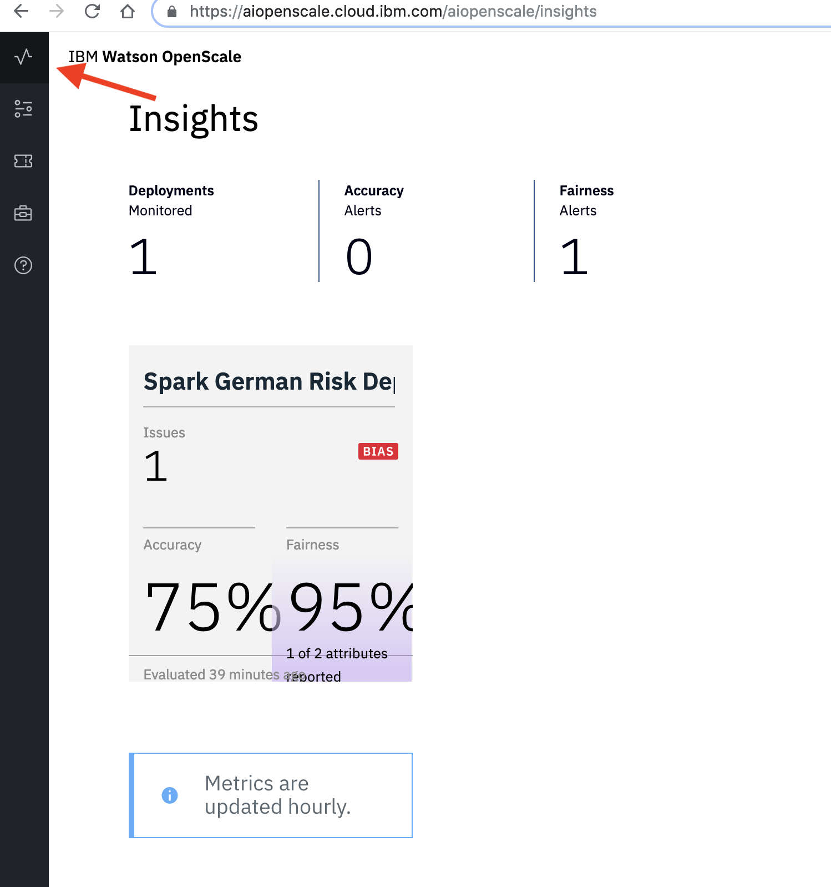
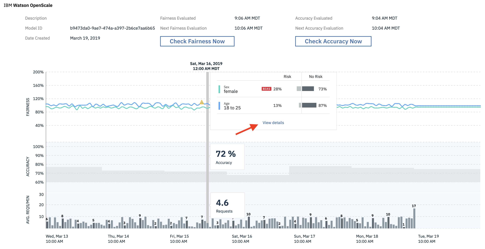
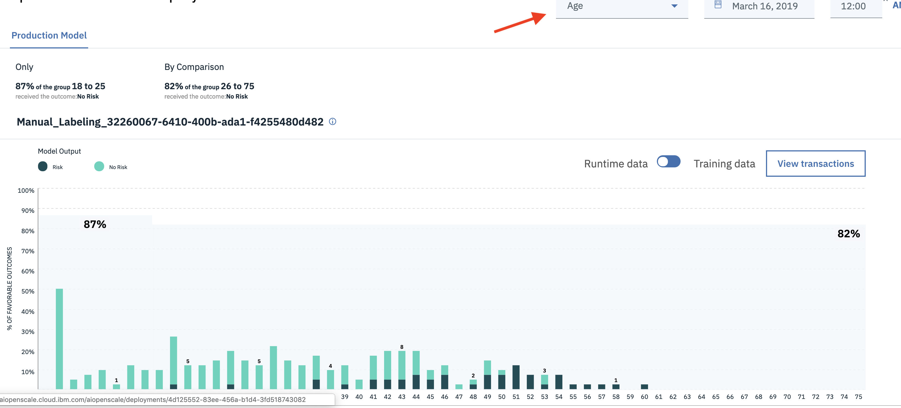
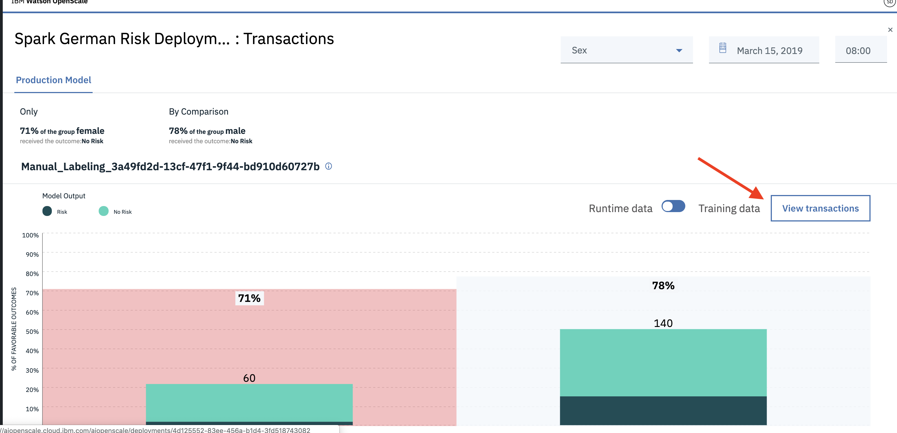
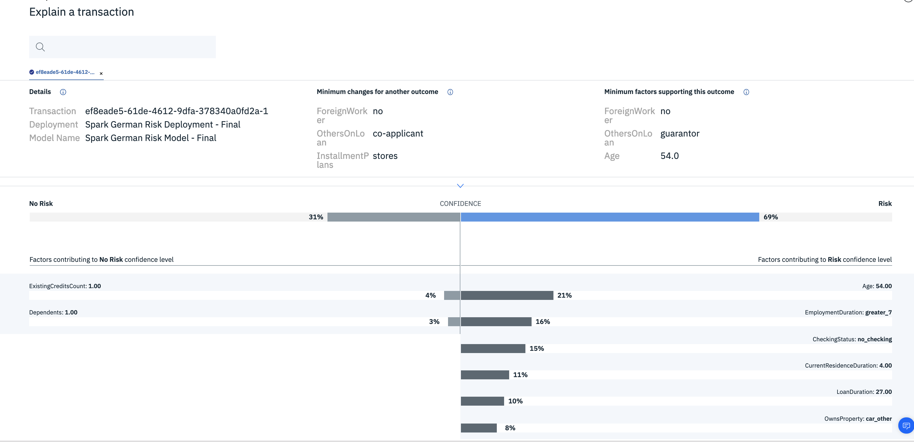

# Monitor WML Model With Watson OpenScale

In this Code Pattern, we will use German Credit data to train, create, and deploy a machine learning model using [Watson Machine Learning](https://console.bluemix.net/catalog/services/machine-learning). We will create a data mart for this model with [Watson OpenScale] and configure OpenScale to monitor that deployment, and inject seven days' worth of historical records and measurements for viewing in the OpenScale Insights dashboard.

When the reader has completed this Code Pattern, they will understand how to:

* Create and deploy a machine learning model using the Watson Machine Learning service
* Setup Watson OpenScale Data Mart
* Bind Watson Machine Learning to the Watson OpenScale Data Mart
* Add subscriptions to the Data Mart
* Enable payload logging and performance monitor for subscribed assets
* Enable Quality (Accuracy) monitor
* Enable Fairness monitor
* Score the German credit model using the Watson Machine Learning
* Insert historic payloads, fairness metrics, and quality metrics into the Data Mart
* Use Data Mart to access tables data via subscription


## Flow

1. The developer creates a Jupyter Notebook on Watson Studio.
2. The Jupyter Notebook is connected to a PostgreSQL database, which is used to store Watson OpenScale data.
3. The notebook is connected to Watson Machine Learning and a model is trained and deployed.
4. Watson OpenScale is used by the notebook to log payload and monitor performance, quality, and fairness.

# Watch the Video

[](https://youtu.be/S6i4p5IB-7c)

## Prerequisites

* An [IBM Cloud Account](https://cloud.ibm.com).
* [IBM Cloud CLI](https://cloud.ibm.com/docs/cli/index.html#overview)
* An account on [IBM Watson Studio](https://dataplatform.cloud.ibm.com/).

# Steps

1. [Clone the repository](#1-clone-the-repository)
1. [Use free internal DB or Create a Databases for PostgreSQL DB](#2-use-free-internal-db-or-create-a-databases-for-postgresql-db)
1. [Create a Watson OpenScale service](#3-create-a-watson-openscale-service)
1. [Create a notebook in IBM Watson Studio](#4-create-a-notebook-in-ibm-watson-studio)
1. [Run the notebook in IBM Watson Studio](#5-run-the-notebook-in-ibm-watson-studio)

### 1. Clone the repository

```bash
git clone https://github.com/IBM/monitor-wml-model-with-watson-openscale
cd monitor-wml-model-with-watson-openscale
```

### 2. Use free internal DB or Create a Databases for PostgreSQL DB

#### If you wish, you can use the free internal Database with Watson OpenScale. To do this, make sure that the cell for `KEEP_MY_INTERNAL_POSTGRES = True` remains unchanged.

#### If you have or wish to use a paid `Databases for Postgres` instance, follow these instructions:

> Note: Services created must be in the same region, and space, as your Watson Studio service.

* Using the [IBM Cloud Dashboard](https://cloud.ibm.com/catalog) catalog, search for PostgreSQL and choose the `Databases for Postgres` [service](https://console.bluemix.net/catalog/services/databases-for-postgresql).
* Wait a couple of minutes for the database to be provisioned.
* Click on the `Service Credentials` tab on the left and then click `New credential +` to create the service credentials. Copy them or leave the tab open to use later in the notebook.
* Make sure that the cell in the notebook that has:

```python
KEEP_MY_INTERNAL_POSTGRES = True
```

is changed to:

```python
KEEP_MY_INTERNAL_POSTGRES = False
```

### 3. Create a Watson OpenScale service

> NOTE: At this time (3/27/19) you must use an instance of Watson OpenScale deployed in the `Dallas` region. This is currently the only region that sends events about scoring requests to the message hub, which is read by OpenScale to populate the payload logging table.

* Using the [IBM Cloud Dashboard]() create a [Watson OpenScale](https://cloud.ibm.com/catalog/services/ai-openscale) service.
* You will get the Watson OpenScale instance GUID when you run the notebook using the [IBM Cloud CLI](https://cloud.ibm.com/catalog/services/ai-openscale)

### 4. Create a notebook in IBM Watson Studio

* In [Watson Studio](https://dataplatform.cloud.ibm.com/), click `New Project +` under Projects or, at the top of the page click `+ New` and choose the tile for `Data Science` and then `Create Project`.
* In your project go to the `Settings` tab, scroll down to `Associated Services` and choose `+ Add service` -> `Spark`. Either choose and `Existing` Spark service, or create a `New` one.
* In [Watson Studio](https://dataplatform.cloud.ibm.com/) using the project you've created, click on `+ Add to project` and then choose the  `Notebook` tile, OR in the `Assets` tab under `Notebooks` choose `+ New notebook` to create a notebook.
* Select the `From URL` tab.
* Enter a name for the notebook.
* Optionally, enter a description for the notebook.
* Under `Notebook URL` provide the following url: https://raw.githubusercontent.com/IBM/monitor-wml-model-with-watson-openscale/master/notebooks/OpenScale.ipynb
* Select the Spark runtime you've associated with this project:
* Click the `Create` button.

### 5. Run the notebook in IBM Watson Studio

Follow the instructions for `Provision services and configure credentials`:

Your Cloud API key can be generated by going to the [**Users** section of the Cloud console](https://cloud.ibm.com/iam#/users).
* From that page, click your name, scroll down to the **API Keys** section, and click **Create an IBM Cloud API key**.
* Give your key a name and click **Create**, then copy the created key and paste it below.

Alternately, from the [IBM Cloud CLI](https://console.bluemix.net/docs/cli/reference/ibmcloud/download_cli.html#install_use) :

```bash
bx login --sso
bx iam api-key-create 'my_key'
```

* Get the Watson OpenScale GUID using the [IBM Cloud CLI](https://console.bluemix.net/docs/cli/reference/ibmcloud/download_cli.html#install_use) :

```bash
bx resource service-instance <Watson_OpenScale_instance_name>
```

* Enter the `AIOS_GUID` and `CLOUD_API_KEY` in the next cell for the `AIOS_CREDENTIALS`.
* Add the [Watson Machine Learning](https://cloud.ibm.com/catalog/services/machine-learning) credentials for the service that you created in the next cell as `WML_CREDENTIALS`.
* Either use the internal Database, which requires *No Changes* or Add your `DB_CREDENTIALS` after reading the instructions preceeding that cell and change the cell `KEEP_MY_INTERNAL_POSTGRES = True` to become `KEEP_MY_INTERNAL_POSTGRES = False`.

* Move your cursor to each code cell and run the code in it. Read the comments for each cell to understand what the code is doing. **Important** when the code in a cell is still running, the label to the left changes to **In [\*]**:.
  Do **not** continue to the next cell until the code is finished running.

### Sample Output

* Go to the instance of [Watson OpenScale](https://aiopenscale.cloud.ibm.com/aiopenscale/insights) that you created and click `Manage` on the menu and then `Launch Application`. Choose the `Insights` tab to get an overview of your monitored deployments, Accuracy alerts, and Fairness alerts.



* Click on the tile for the `Spark German Risk Deployment` and you can see graphs for `Fairness`, `Accuracy`, and `Performance (Avg. Requests/Minute)`. Click on a portion of the graph to bring up a detailed view. We'll describe the data we clicked on, yours will vary.



* You can see from the image above that, at this time, our model is receiving 4.6 requests per minute, with an accuracy of 72%. We have 13% of our credit risk (and 87% of no risk) due the fact that this individual is age 18 to 25, and 28% credit risk (and 72% of no risk) due to the fact that this individual is female. This latter statistic id flagged as `bias`.

* Now click `View details`.



* We can see that, for the `age` category, 87% of 18 to 25 year olds received `No Risk` compared to 82% of 26 to 75 year olds. This is not flagged as biased.

* Now click on the tab marked `age` and change it to `sex`. We can see that only 71% of the females group received the outcome of `No Risk` as compared to 78% of the male group. This is flagged as `BIAS`. Now click on `View Transactions`.



* In the `Explain a transaction` window, we can see the details as to which feature contributed specific amounts to the overall assesment of `Risk` vs. `No Risk`, as well as `Minimum changes for another outcome` and `Minimum factors supporting this outcome`.



# License
[Apache 2.0](LICENSE)
